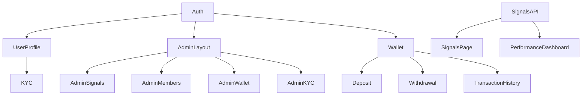

# ATH Trader — Task Plan (MVP 1-4 Weeks)

> ลำดับความสำคัญตามความจำเป็นของระบบ  
> **ทีม:** Frontend 1 คน, Backend 1 คน, Fullstack 1 คน, Designer 1 คน

---

## Week 1 — Foundation & Core Auth

| Priority | Task | Owner | Details |
|----------|------|-------|---------|
| P0 | **Project Scaffolding** | Fullstack | Next.js 14 App Router + Tailwind CSS + Express API structure |
| P0 | **Database Setup** | Backend | PostgreSQL connection, `initDB()`, migration script |
| P0 | **Auth System — Login/Register** | Backend | JWT (access + refresh), bcrypt, rate limiter, validation |
| P0 | **Auth UI — Login/Register Pages** | Frontend | Next.js pages with form validation, error handling |
| P1 | **User Profile API** | Backend | `GET/PUT /api/auth/me`, avatar upload |
| P1 | **Role-based Access Control** | Backend | RBAC middleware (admin, user, super-admin) |
| P1 | **Admin Layout** | Frontend | Sidebar navigation, protected route, admin wrapper |
| P2 | **Navbar + Footer** | Frontend | Responsive design, mobile hamburger menu |

## Week 2 — Content Management & Signals

| Priority | Task | Owner | Details |
|----------|------|-------|---------|
| P0 | **Home Page** | Frontend | Hero, stats, brokers, signals, articles sections (already built in Next.js) |
| P0 | **Signals CRUD API** | Backend | `/api/signals` — full CRUD, filter by status/pair/direction |
| P0 | **Signals Page + Cards** | Frontend | Filter tabs (all/BUY/SELL), real-time status badges |
| P1 | **Articles API** | Backend | `/api/articles` — CRUD + AI generation endpoint |
| P1 | **Articles Page** | Frontend | Grid layout, image support, date formatting |
| P1 | **Brokers API + Page** | Backend + Frontend | Broker CRUD, rating stars, IB link, promotion modal |
| P1 | **Contact API + Page** | Backend + Frontend | Contact channels, QR codes, CMS via admin |
| P2 | **Admin Dashboard** | Frontend | Stats cards (total users, signals, articles, brokers) |

## Week 3 — VIP, Accounts & Payment Foundation

| Priority | Task | Owner | Details |
|----------|------|-------|---------|
| P0 | **Accounts Page** | Frontend | VIP plan cards, comparison table, FAQ, CTA |  
| P0 | **VIP Level API** | Backend | `PUT /api/users/:id/vip`, upgrade/downgrade logic |
| P1 | **Wallet Schema** | Backend | `wallets`, `transactions` tables (from schema) + balance API |
| P1 | **Deposit API** | Backend | `/api/wallet/deposit` — create transaction, upload slip |
| P1 | **Deposit UI** | Frontend | Slip upload, payment method selection, status tracking |
| P2 | **Withdrawal API** | Backend | `/api/wallet/withdraw` — request, admin approval flow |
| P2 | **Withdrawal UI** | Frontend | Withdrawal form, bank account management, history |
| P2 | **Admin — Wallet Management** | Frontend | Approve/reject deposits/withdrawals, manual adjust |

## Week 4 — KYC, Notifications & Polish

| Priority | Task | Owner | Details |
|----------|------|-------|---------|
| P0 | **KYC Schema + API** | Backend | `kyc_submissions`, `kyc_documents` tables, submit/approve/reject |
| P0 | **KYC UI** | Frontend | Multi-step form: personal info → ID upload → selfie → submit |
| P1 | **Admin — KYC Review** | Frontend | Document viewer, approve/reject with reason, verification log |
| P1 | **Notification System** | Backend | LINE Messaging API integration, in-app notification table |
| P1 | **Transaction History** | Frontend | Paginated list of deposits/withdrawals with status badges |
| P2 | **Mobile Optimization** | Frontend | Touch-friendly tables, responsive forms, bottom sheet modals |
| P2 | **Performance Dashboard** | Frontend | Win rate by pair/month, charts (Recharts/Chart.js) |
| P2 | **EA Dashboard** | Frontend | Account monitor, heartbeat log, lot size config |
| P2 | **Testing + Bug Fixes** | All | Cross-browser testing, API error handling, edge cases |

---

## Key Deliverables Summary

| Module | Week | ไฟล์/Components หลัก |
|--------|------|----------------------|
| Auth | 1 | `app/(auth)/login`, `app/(auth)/register`, `server/routes/auth.js` |
| Home Page | 2 | `app/page.tsx`, `components/{Hero,StatsGrid,SignalCard,BrokerCard,ArticleCard}` |
| Accounts | 3 | `app/accounts/page.tsx`, `components/VipPlanCard` |
| Wallet | 3 | `server/routes/wallet.js`, `app/wallet/*` |
| KYC | 4 | `app/kyc/*`, `server/routes/kyc.js`, `components/KycForm` |
| Admin | 2-4 | `app/admin/*`, `server/routes/admin/*` |

---

## Dependencies

---

## Tech Stack

| Layer | Technology |
|-------|-----------|
| Framework | Next.js 14 (App Router) |
| UI | Tailwind CSS 3 |
| State | React hooks + Context API |
| Backend | Express.js (existing) |
| Database | PostgreSQL 15+ |
| Auth | JWT (jsonwebtoken + bcryptjs) |
| Notification | LINE Messaging API |
| CI/CD | GitHub Actions + Vercel |
